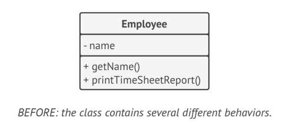
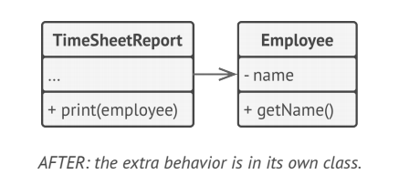
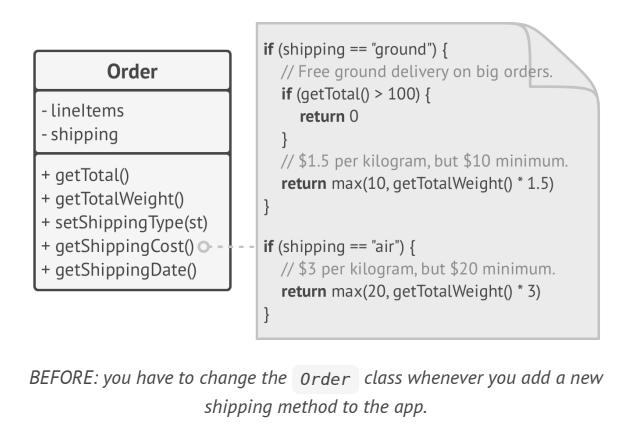
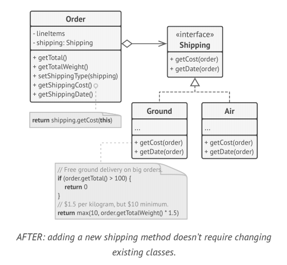

# Development Principle
============

## Reference

* [List of software development philosophies - wikipedia](https://en.wikipedia.org/wiki/List_of_software_development_philosophies)
* [Programming principles - wikipedia](https://en.wikipedia.org/wiki/Category:Programming_principles)
* [Software design - wikipedia](https://en.wikipedia.org/wiki/Software_design)

## Content

### SOLID

* **(1) SRP - Single Responsibility Principle**
  * `A class should have just one reason to change.`
  * => reducing complexity. 
  * => if a class does too many things
    * => have to change it every time one of these things changes. 
    * => risking breaking other parts of the class which didn’t even intend to change.
  * 
  * 
* **(2) OCP - Open/Closed Principle**
  * `Classes should be open for extension but closed for modification.`
  * => keep existing code from breaking when implementing new features.
  * => a class is open if can extend it, produce a subclass, and do whatever want with it add new methods or fields, override base behavior, etc. 
  * => a class can be both open (for extension) and closed (for modification) at the same time.
  * => instead of changing the code of the class directly, can create a subclass and override parts of the original class that want to behave differently. 
  * => this principle isn’t meant to be applied for all changes to a class. 
  * => a child's class shouldn’t be responsible for the parent’s issues.
  * 
  * 
* **(3) LSP - Liskov Substitution Principle**
  * `When extending a class, should be able to pass objects of the subclass in place of objects of the parent class without breaking the client code.`
  * => This means that the subclass should remain compatible with the behavior of the superclass. 
  * => When overriding a method, extend the base behavior rather than replacing it with something else entirely.
  * => The substitution principle is a set of checks that help predict whether a subclass remains compatible with the code that was able to work with objects of the superclass. 
  * => This concept is critical when developing libraries and frameworks because your classes are going to be used by other people whose code you can’t directly access and change.
  * => has a set of formal requirements for subclasses, and specifically for their methods:
    * Parameter types in a method of a subclass should match or be more abstract than parameter types in the method of the superclass. 
      * Say there’s a class with a method that’s supposed to feed cats: `feed(Cat c)`. Client code always passes cat objects into this method.
      * Good: Say you created a subclass that overrode the method so that it can feed any animal (a superclass of cats): `feed(Animal c)`. Now if you pass an object of this subclass instead of an object of the superclass to the client code, everything would still work fine. The method can feed all animals, so it can still feed any cat passed by the client.
      * Bad: You created another subclass and restricted the feeding method to only accept Bengal cats (a subclass of cats): `feed(BengalCat c)`. What will happen to the client code if you link it with an object like this instead of with the original class? Since the method can only feed a specific breed of cats, it won’t serve generic cats passed by the client, breaking all related functionality.
    * The return type in a method of a subclass should match or be a subtype of the return type in the method of the superclass.
      * Say you have a class with a method `buyCat(): Cat`. The client code expects to receive any cat as a result of executing this method.
      * Good: A subclass overrides the method as follows: `buyCat(): BengalCat`. The client gets a Bengal cat, which is still a cat, so everything is okay.
      *  Bad: A subclass overrides the method as follows: `buyCat(): Animal`. Now the client code breaks since it receives an unknown generic animal (an alligator? a bear?) that doesn’t fit a structure designed for a cat.
      * Another anti-example comes from the world of programming languages with dynamic typing: the base method returns a string, but the overridden method returns a number.
    * A method in a subclass shouldn’t throw types of exceptions which the base method isn’t expected to throw. 
      * In other words, types of exceptions should match or be subtypes of the ones that the base method is already able to throw. 
      * This rule comes from the fact that try-catch blocks in the client code target specific types of exceptions which the base method is likely to throw. 
      * Therefore, an unexpected exception might slip through the defensive lines of the client code and crash the entire application.
    * A subclass shouldn’t strengthen pre-conditions. 
      * For example, the base method has a parameter with type int .
      * If a subclass overrides this method and requires that the value of an argument passed to the method should be positive (by throwing an exception if the value is negative), this strengthens the pre-conditions. 
      * The client code, which used to work fine when passing negative numbers into the method, now breaks if it starts working with an object of this subclass.
    * A subclass shouldn’t weaken post-conditions. 
      * Say you have a class with a method that works with a database. 
      * A method of the class is supposed to always close all opened database connections upon returning a value.
      * You created a subclass and changed it so that database connections remain open so you can reuse them. 
      * But the client might not know anything about your intentions.
      * Because it expects the methods to close all the connections, it may simply terminate the program right after calling the method, polluting a system with ghost database connections.
    * Invariants of a superclass must be preserved. 
      * Invariants are conditions in which an object makes sense. 
      * For example, invariants of a cat are having four legs, a tail, the ability to meow, etc. 
      * The rule on invariants is the easiest to violate because might misunderstand or not realize all of the invariants of a complex class. 
      * Therefore, the safest way to extend a class is to introduce new fields and methods, and not mess with any existing members of the superclass. 
    * A subclass shouldn’t change the values of private fields of the superclass. 
      * Some programming languages let access private members of a class via reflection mechanisms. 
      * Other languages (Python, JavaScript) don’t have any protection for the private members at all.
* **(4) ISP - Interface Segregation Principle**
* **(5) DIP - Dependency Inversion Principle**

### KISS

### YAGNI

### DRY

