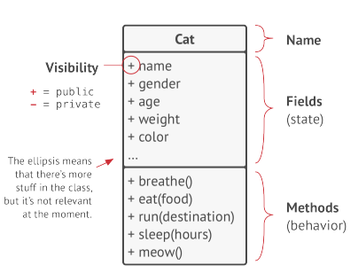

# Object Oriented
============

## Reference

* [Dive Into Design Pattern - Alexander Shvets](https://drive.google.com/file/d/19EkJ5pbSqp2n5yqGH7orlREUJ7PbXtdo/view?usp=sharing)
* [Object-oriented programming - wikipedia](https://en.wikipedia.org/wiki/Object-oriented_programming)
* [Comparison of programming languages (object-oriented programming) - wikipedia](https://en.wikipedia.org/wiki/Comparison_of_programming_languages_(object-oriented_programming)#Object_construction_and_destruction)
* [Index of object-oriented programming articles - wikipedia](https://en.wikipedia.org/wiki/Index_of_object-oriented_programming_articles)

## Content

### Basics of OOP

* **(1) Object & Class**
  * `Class` has `data` and `behavior` related that its data.
  * A `class` is like a `blueprint` that defines the `structure` for `object`, which are `concrete instances` of `class`.
  * 
  * `Field` (State) & `Method` (Behavior) can be referenced as the `members` of `class`.
  * `Objects` are `instances` of `classes`.
  * 
* **(2) Class Hierarchies**
  * `Subclass` (Children class)  inherit `state` and `behavior` from their `Superclass` (Parents class), defining only `state` or `behavior` that differ.
  * `Subclass` can `override` the `behavior` of `methods` that they inherit from `Superclass`.
  * `Subclass` can either completely `replace` the `default behavior` or just enhance it with some extra stuff.
  * 

### Pillars of OOP

* 
* **(1) Abstraction**
  * Abstraction is a `model` of a `real-world object` or phenomenon, limited to a specific context, which represents all details relevant to this context with high accuracy and omits all the rest.
  * The interface mechanism lets `define contracts` of interaction between `objects`.
  * The interface `only care` about the `behaviors` of the `object` and `can not` declare a `field` in an `interface`.
  * 
* **(2) Encapsulation**
  * Encapsulation is the `ability` of an `object` to `hide part` of its `states` and `behaviors` from `other objects`, `exposing only` a `limited interface` to the rest of the program.
  * => make it `private`: `accessible only` from `within` of the `methods` of its own class.
  * => make it `protected`: makes a `member of a class` available to `subclass`.
  * 
* **(3) Inheritance**
  * Inheritance is the `ability` to `build new classes` on top of existing ones.
  * => The main benefit of inheritance is `code reuse`.
  * => `Subclasses` have the `same interface` as their `Superclass`.
  * => `Must implement all abstract methods`.
  * => `A subclass can extend only one superclass`.
  * => `Any class` can `implement` several `interfaces` at the same time.
  * => If a `superclass implements an interface`, all of its `subclasses must also implement it`.
  * 
* **(4) Polymorphism**
  * Polymorphism is the `ability` of a program to `detect` the `real class` of an object and `call its implementation` even when its real type is unknown in the current context.
  * => Declare `abstract` class.
  * => `Omit any default implementation of the method in the superclass` but `force all subclasses to come up with their own`.
  *   

### Relations Between Objects

* **(1) Association**
  *  
  * Association is a type of relationship in which one object `uses` or `interacts` with another.
  * Can having a bi-directional association is a completely normal thing. 
  * Use an association to represent something like a field in a class. 
* **(2) Dependency**
  * 
  * Dependency is a weaker variant of association that usually implies that there’s `no permanent link` between objects.
  * Dependency typically (but not always) implies that an object `accepts` another object as a `method parameter`, `instantiates`, or uses `another object`. 
  * Here’s how can spot a dependency between classes: a dependency exists between two classes if changes to the definition of one class result in modifications in another class.
* **(3) Composition**
  * 
  * Composition is a `whole-part` relationship between two objects, one of which is composed of one or more instances of the other.
  * The distinction between this relation and others is that the component can only exist as a part of the container.
* **(4) Aggregation**
  * 
  * Aggregation is a less strict variant of `composition`, where one object merely contains a reference to another. 
  * The container doesn’t control the life cycle of the component. 
  * The component can exist without the container and can be linked to several containers at the same time. 
