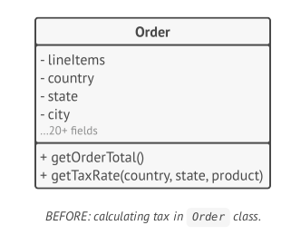
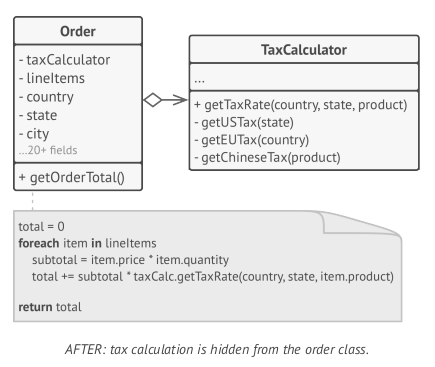
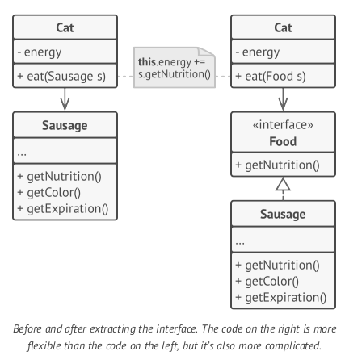
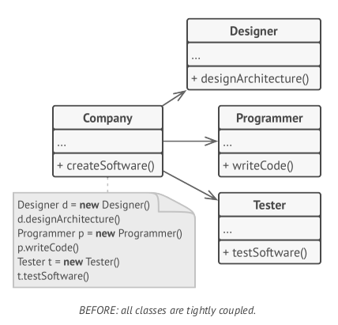
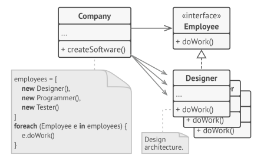
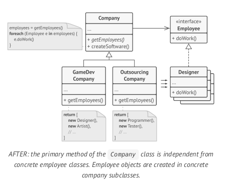
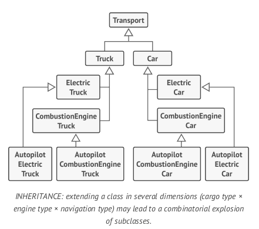
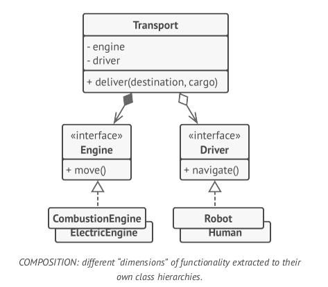

# Software Design
============

## Reference

* [Software design - wikipedia](https://en.wikipedia.org/wiki/Software_design)

## Content

### Features of Good Design

* **Code reuse**
  * `Reduce` development costs
  * Use `design patterns` => components more complicated
* **Extensibility**
  * `Change is the only constant thing in a programmer's life.`

### Common Design Principle

* **(1) Encapsulate What Vries**
  * To minimize the effect caused by changes.
  * Encapsulate on a `method` level
    * Extract the logic into a separate method.
    * Hiding it from the original method.
  * Encapsulate on a `class` level
    * Extract every thing to a new class.
    * 
    * 
* **(2) Program to an Interface, not an Implementation**
  * Depend on `abstraction`, not on `concrete classes`.
  * Make two classes collaborate => making one of them dependent on the other.
  * Way to setup collaborate between objects
    * 1> Determine what exactly one object needs from the other: which methods does it execute?
    * 2> Describe these methods in a new interface or abstract class
    * 3> Make the class that is a dependency implement this interface.
    * 4> Now make the second class dependent on this interface rather than on the concrete class.
    * 
  * 
  * 
  * 
* **(3) Favor Composition Over Inheritance**
  * Problem of Inheritance
    * `A subclass can’t reduce the interface of the superclass`. You have to implement all abstract methods of the parent class even if you won’t be using them.
    * `When overriding methods you need to make sure that the new behavior is compatible with the base one`. It’s important because objects of the subclass may be passed to any code that expects objects of the superclass and you don’t want that code to break.
    * `Inheritance breaks encapsulation of the superclass` because the internal details of the parent class become available to the subclass. There might be an opposite situation where a programmer makes a superclass aware of some details of subclasses for the sake of making further extension easier.
    * `Subclasses are tightly coupled to superclasses`. Any change in a superclass may break the functionality of subclasses.
    * `Trying to reuse code through inheritance can lead to creating parallel inheritance hierarchies`. Inheritance usually takes place in a single dimension. But whenever there are two or more dimensions, you have to create lots of class combinations, bloating the class hierarchy to a ridiculous size.
  * Inheritance represents the `IS-A` relationship between classes.
  * `Composition` represents the `HAS-A` relationship between classes => Can replace a behavior at runtime.
  * 
  * 
